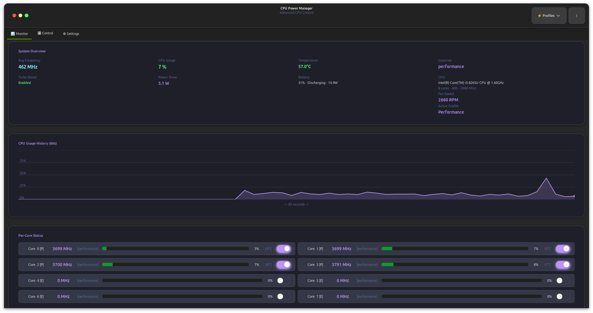
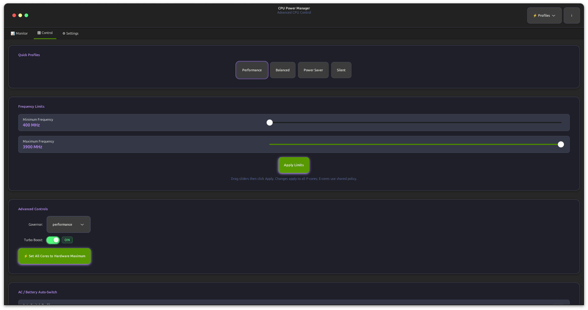
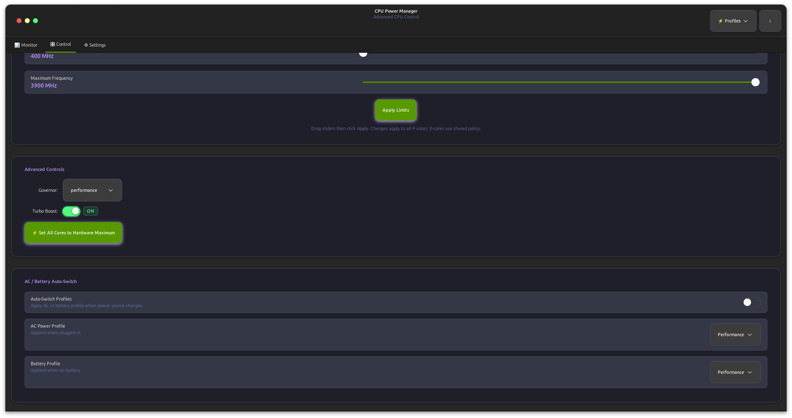
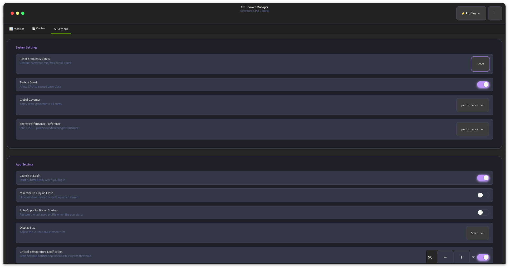
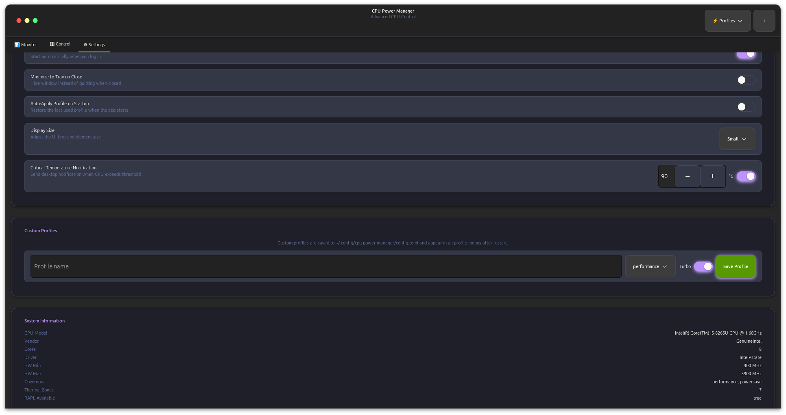

# CPU Power Manager

> A modern Linux GUI utility for monitoring and controlling CPU performance, power usage, and thermal behaviour. Built with a Rust backend and a sleek GTK4 interface styled with the full Dracula colour palette, it provides real-time insights into frequency scaling, governors, turbo boost, per-core temperatures, battery status, fan speed, and Intel RAPL power draw — all in one place.

[](LICENSE)
[]()
[]()
[]()
[]()

**Website:** [www.jegly.xyz](https://www.jegly.xyz)

---

## Screenshots

<p align="center">
  
  <br/><br/>
  
  <br/><br/>
  
  <br/><br/>
  
  <br/><br/>
  
</p>

---

## Features

### Monitor Tab
- **System Overview dashboard** — 4-column grid of live metric cards: Avg Frequency, CPU Usage, Temperature, Governor, Turbo Boost, Power Draw, Battery, Fan Speed
- **60-second CPU usage graph** — Cairo-rendered area chart with Dracula purple fill
- **Per-core status panel** — every core shows: frequency, governor, usage bar, usage %, temperature, P-core / E-core label, online/offline toggle
- **Intel hybrid CPU support** — P-cores and E-cores handled gracefully; missing sysfs files are silently skipped

### Power & Thermal Data
- **Intel RAPL power draw** — two-sample energy delta from `/sys/class/powercap/intel-rapl`, updated every second
- **Battery status** — charge %, AC/battery detection, live power draw in watts, charge status string
- **Fan speed** — first non-zero RPM from hwmon drivers
- **Per-core temperatures** — reads `coretemp` hwmon driver labels ("Core 0", "Core 1" …)
- **Critical temperature notifications** — desktop notification when CPU exceeds a configurable threshold

### Control Tab
- **Frequency sliders** — min/max sliders with Apply button; respects hardware limits
- **AC / Battery auto-switch** — detects power-source change every second and applies the configured profile automatically
- **Profile quick-switcher** — header popover for one-click switching

### Profile System

| Profile | Governor | Turbo | Best For |
|---|---|---|---|
| Performance | performance | Always on | Gaming, compilation |
| Balanced | schedutil | Auto | Daily productivity |
| Power Saver | powersave | Off | Battery life |
| Silent | powersave | Off, ≤2 GHz | Quiet operation |

- **Custom profiles** — create, name, and persist profiles; appear in all menus after restart

### Settings
- Launch at Login — writes `~/.config/autostart/cpu-power-manager.desktop`
- Minimize to Tray on Close — hides the window instead of quitting
- Auto-Apply Profile on Startup — restores last used profile
- Critical Temperature Notification — toggle + configurable °C threshold
- **Display Size** — Small / Normal / Large / X-Large; scales the entire UI instantly without restart
- AC and Battery profile selection for auto-switching

### System Tray
- Status icon via **StatusNotifierItem** (pure-Rust `zbus`, no C libdbus headers required)
- Menu: Show/Hide Window and Quit
- Fails gracefully when no DBus session bus is available

### UI & Design
- Full **Dracula colour palette** throughout — backgrounds, text, accents, status colours, graph, scrollbars
- **macOS-style circular traffic-light buttons** — Cairo-drawn 13 px dots (red/yellow/green) with hover dimming
- GTK4 + Rust — no Electron, no Python, small binary
- Responsive layout with scrollable per-core panel

---

## System Requirements

- Linux kernel 4.4+ with `cpufreq` support
- GTK4 4.10+
- libadwaita 1.5+
- PolicyKit (for privilege escalation)
- Intel or AMD CPU with frequency scaling support

### Supported CPU Drivers
- `intel_pstate` — Intel processors including 12th gen+ hybrid (P/E-core)
- `amd_pstate` — AMD processors
- `acpi-cpufreq` — fallback for older systems

---

## Installation

### From .deb Package (Debian/Ubuntu)

```bash
sudo dpkg -i cpu-power-manager_1.0.3_amd64.deb
sudo apt-get install -f
```

### From Source

**Debian/Ubuntu dependencies:**
```bash
sudo apt install build-essential cargo rustc libgtk-4-dev \
    libadwaita-1-dev libglib2.0-dev pkg-config policykit-1
```

**Fedora:**
```bash
sudo dnf install gtk4-devel libadwaita-devel glib2-devel rust cargo pkgconfig polkit
```

**Arch Linux:**
```bash
sudo pacman -S base-devel rust gtk4 libadwaita pkgconf polkit
```

#### Build and Install

```bash
git clone https://github.com/jegly/cpu-power-manager.git
cd cpu-power-manager

cargo build --release

sudo cp target/release/cpu-power-manager /usr/local/bin/
sudo cp assets/cpu-power-manager.desktop /usr/share/applications/
sudo cp assets/com.cpupowermanager.policy /usr/share/polkit-1/actions/
sudo cp assets/icon.svg /usr/share/icons/hicolor/scalable/apps/cpu-power-manager.svg
sudo gtk-update-icon-cache /usr/share/icons/hicolor/
```

#### Building a .deb Package

```bash
cargo install cargo-deb
cargo deb
# Output: target/debian/cpu-power-manager_*.deb
```

---

## Running

```bash
# GUI — requires root for frequency/governor writes
sudo -E cpu-power-manager

# Start minimised to tray
sudo -E cpu-power-manager --minimized
```

> Pass `-E` to `sudo` to preserve your `DBUS_SESSION_BUS_ADDRESS` so the system tray works correctly.

### CLI

```bash
cpu-power-manager status
cpu-power-manager set-governor performance
cpu-power-manager set-frequency 3000
cpu-power-manager set-turbo true
cpu-power-manager apply-profile balanced
cpu-power-manager version
```

---

## Configuration

Config file: `~/.config/cpu-power-manager/config.toml`

```toml
[general]
auto_start = true
start_minimized = false
minimize_to_tray = false
auto_apply_on_startup = false
last_profile = "balanced"
critical_temp_notify = true
polling_interval_ms = 1000
temperature_unit = "celsius"
ui_scale = "normal"           # small | normal | large | xlarge

[auto_tune]
enabled = true
ac_profile = "performance"
battery_profile = "balanced"
temp_threshold_high = 80
temp_threshold_low = 60
load_threshold_high = 70
load_threshold_low = 30

[thermal]
max_temp_celsius = 90
emergency_temp_celsius = 95

[monitoring]
enable_graphs = true
graph_history_seconds = 300
show_per_core_stats = true
```

---

## Troubleshooting

**Can't change frequency/governor** — run with `sudo -E` and verify the cpufreq driver is loaded:
```bash
cat /sys/devices/system/cpu/cpu0/cpufreq/scaling_driver
```

**System tray not appearing** — run with `sudo -E` to preserve `DBUS_SESSION_BUS_ADDRESS`.

**Temperature not showing** — install `lm-sensors` and run `sudo sensors-detect`.

**E-core frequencies showing 0 MHz** — expected on Intel 12th gen+ hybrid CPUs; E-cores share a policy group and don't expose individual `scaling_cur_freq` files.

---

## Roadmap

- [ ] GPU frequency monitoring
- [ ] Fan curve control
- [ ] Profile import/export
- [ ] Integration with `power-profiles-daemon`

---

## Acknowledgements

- Dracula Theme — [draculatheme.com](https://draculatheme.com/)
- Inspired by [auto-cpufreq](https://github.com/AdnanHodzic/auto-cpufreq) and [Watt](https://github.com/NotAShelf/watt)
- GTK4 and libadwaita by [GNOME](https://www.gnome.org/)

---

## License

GNU General Public License v3.0 — see [LICENSE](LICENSE) for details.

> **Note:** Changing CPU frequencies and governors requires root privileges. Use with care.
